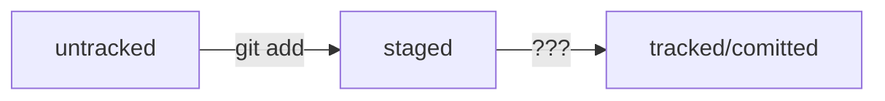

# Заголовок1
## Заголовок2
### Заголовок3
------
разрыв <br> строки

разрыв2  строки

Текст текст текст

Новый параграф
Выделение
*курсив* _курсив2_
**полужирный** __полужирный2__
~~две тильды=зачеркнутый~~

-----
Списки
1. Первый пункт
2. Второй пункт
3. Третий пошел

* Первый ненумированный
* Второй ненумерованный

- С дефисом Первый ненумированный
- С дефисом Второй ненумерованный

----
Ссылки [Хабр](https://habr.com/ru/articles/)
Ссылка со вспывающей подсказкой [Хабр](https://habr.com/ru/articles/ "Есть, что почитать= это тайтл")

------
Код:
```Python
num=int(input("введите число:"))
print("удвоенное значение числа:", num*2)
```

Блоки кода в маркдауне обособляются тремя символами ```. После первых трёх указать, какой именно код будет внутри блока. Например: ```mermaid , ```bash, ```python, ```javascript и так далее. Если ничего не указать, GitHub будет считать весь код простым текстом.

-------

# mermaid-схема
## Структура
HEAD -- это голова.<br>
Коммит -- это всему голова.<br>
Статусы файлов:<br>


## Пример



--------